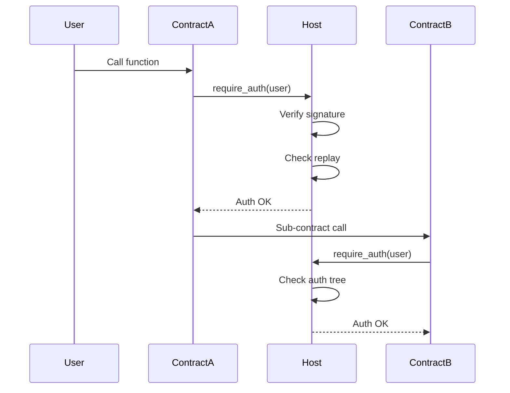

## Overview

Soroban provides a robust authentication and authorization system centered around the `Address` type. The system handles signature verification, replay prevention, and supports custom account contracts for advanced authentication logic.

## Basic Authentication

### require_auth()

The most common authentication method requires authorization for the entire contract function call:

```rust
use soroban_sdk::{contract, contractimpl, Address, Env};

#[contract]
pub struct Contract;

#[contractimpl]
impl Contract {
    pub fn transfer(env: Env, from: Address, to: Address, amount: i128) {
        // Requires 'from' to authorize this call
        from.require_auth();
        
        // Transfer logic...
        let balance = get_balance(&env, &from);
        set_balance(&env, &from, balance - amount);
        set_balance(&env, &to, get_balance(&env, &to) + amount);
    }
}
```

<Note>
`require_auth()` automatically verifies signatures and prevents replay attacks. Contracts don't need to implement these security measures.
</Note>

### require_auth_for_args()

For more control, authorize specific arguments instead of the entire call:

```rust
use soroban_sdk::{Vec, IntoVal};

#[contractimpl]
impl Contract {
    pub fn complex_transfer(
        env: Env,
        from: Address,
        to: Address,
        amount: i128,
        memo: String,
    ) {
        // Only authorize the critical parameters
        let auth_args: Vec<Val> = (from.clone(), to.clone(), amount).into_val(&env);
        from.require_auth_for_args(auth_args);
        
        // The memo doesn't need authorization
        perform_transfer(&env, from, to, amount, memo);
    }
}
```

<Tip>
Use `require_auth_for_args()` when some function parameters shouldn't be part of the authorization (like metadata or optimization hints).
</Tip>

## Authorization Context

The Soroban host tracks authorization through a tree of invocations:

### Single Contract Call

```rust
#[contractimpl]
impl Contract {
    pub fn withdraw(env: Env, user: Address, amount: i128) {
        user.require_auth();
        // Host verifies authorization for this specific call
    }
}
```

### Cross-Contract Calls

When contracts call other contracts, authorization flows through:

```rust
#[contract]
pub struct ContractA;

#[contractimpl]
impl ContractA {
    pub fn do_transfer(env: Env, from: Address, amount: i128) {
        from.require_auth_for_args((amount / 2,).into_val(&env));
        
        // Call another contract
        let token = TokenClient::new(&env, &get_token_address(&env));
        token.transfer(&from, &env.current_contract_address(), &amount);
    }
}
```

## Testing Authentication

### Mock All Auths

For testing, mock all authorization calls:

```rust
#[cfg(test)]
mod tests {
    use super::*;
    use soroban_sdk::testutils::Address as _;

    #[test]
    fn test_transfer() {
        let env = Env::default();
        let contract_id = env.register(Contract, ());
        let client = ContractClient::new(&env, &contract_id);
        
        // Mock all authorization
        env.mock_all_auths();
        
        let user = Address::generate(&env);
        client.transfer(&user, &Address::generate(&env), &100);
        
        // Verify auth was required
        assert_eq!(env.auths().len(), 1);
    }
}
```

### Verify Authorization Tree

Inspect the authorization tree to verify correct auth behavior:

```rust
use soroban_sdk::testutils::{AuthorizedFunction, AuthorizedInvocation};

#[test]
fn test_auth_tree() {
    let env = Env::default();
    let contract_id = env.register(Contract, ());
    let client = ContractClient::new(&env, &contract_id);
    
    env.mock_all_auths();
    
    let user = Address::generate(&env);
    client.transfer(&user, &Address::generate(&env), &100);
    
    // Verify exact authorization structure
    assert_eq!(
        env.auths(),
        [(
            user.clone(),
            AuthorizedInvocation {
                function: AuthorizedFunction::Contract((
                    contract_id.clone(),
                    Symbol::new(&env, "transfer"),
                    (&user, &to, 100i128).into_val(&env)
                )),
                sub_invocations: vec![]
            }
        )]
    );
}
```

### Mock Specific Auths

Mock only specific authorizations:

```rust
use soroban_sdk::testutils::{MockAuth, MockAuthInvoke};

#[test]
fn test_specific_auth() {
    let env = Env::default();
    let contract_id = env.register(Contract, ());
    let client = ContractClient::new(&env, &contract_id);
    
    let user = Address::generate(&env);
    
    // Mock only this specific call
    client.mock_auths(&[
        MockAuth {
            address: &user,
            invoke: &MockAuthInvoke {
                contract: &contract_id,
                fn_name: "transfer",
                args: (&user, &to, 100i128).into_val(&env),
                sub_invokes: &[],
            },
        },
    ]).transfer(&user, &to, &100);
}
```

## Custom Account Contracts

Implement custom authentication logic with account contracts:

### Basic Custom Account

```rust
use soroban_sdk::auth::{CustomAccountInterface, Context};
use soroban_sdk::crypto::Hash;

#[contract]
pub struct CustomAccount;

#[contractimpl]
impl CustomAccountInterface for CustomAccount {
    type Signature = BytesN<64>;
    type Error = Error;

    fn __check_auth(
        env: Env,
        signature_payload: Hash<32>,
        signature: BytesN<64>,
        auth_contexts: Vec<Context>,
    ) -> Result<(), Error> {
        // Custom authentication logic
        let public_key: BytesN<32> = env.storage()
            .instance()
            .get(&symbol_short!("PUB_KEY"))
            .ok_or(Error::NotInitialized)?;
        
        // Verify signature
        env.crypto().ed25519_verify(
            &public_key,
            &signature_payload.into(),
            &signature,
        );
        
        // Validate auth contexts
        for context in auth_contexts.iter() {
            validate_context(context)?;
        }
        
        Ok(())
    }
}
```

### Multi-Sig Account

```rust
#[contracttype]
pub struct MultiSigSignature {
    pub signatures: Vec<BytesN<64>>,
}

#[contractimpl]
impl CustomAccountInterface for MultiSigAccount {
    type Signature = MultiSigSignature;
    type Error = Error;

    fn __check_auth(
        env: Env,
        signature_payload: Hash<32>,
        signature: MultiSigSignature,
        auth_contexts: Vec<Context>,
    ) -> Result<(), Error> {
        let signers: Vec<BytesN<32>> = env.storage()
            .instance()
            .get(&symbol_short!("SIGNERS"))
            .ok_or(Error::NotInitialized)?;
        
        let threshold: u32 = env.storage()
            .instance()
            .get(&symbol_short!("THRESHOLD"))
            .ok_or(Error::NotInitialized)?;
        
        // Verify required number of signatures
        let mut valid_sigs = 0u32;
        for (i, sig) in signature.signatures.iter().enumerate() {
            if i >= signers.len() {
                break;
            }
            
            let signer = signers.get(i as u32).unwrap();
            env.crypto().ed25519_verify(
                &signer,
                &signature_payload.into(),
                &sig,
            );
            valid_sigs += 1;
        }
        
        if valid_sigs < threshold {
            return Err(Error::InsufficientSignatures);
        }
        
        Ok(())
    }
}
```

## Authorization Patterns

### Admin-Only Functions

```rust
#[contractimpl]
impl Contract {
    pub fn set_config(env: Env, admin: Address, config: Config) {
        admin.require_auth();
        
        // Verify admin
        let stored_admin: Address = env.storage()
            .instance()
            .get(&symbol_short!("ADMIN"))
            .unwrap();
        
        if admin != stored_admin {
            panic_with_error!(&env, Error::Unauthorized);
        }
        
        env.storage().instance().set(&symbol_short!("CONFIG"), &config);
    }
}
```

### Allowance Pattern

```rust
#[contractimpl]
impl Token {
    pub fn transfer_from(
        env: Env,
        spender: Address,
        from: Address,
        to: Address,
        amount: i128,
    ) {
        spender.require_auth();
        
        // Check allowance
        let allowance = get_allowance(&env, &from, &spender);
        if amount > allowance {
            panic_with_error!(&env, Error::InsufficientAllowance);
        }
        
        // Reduce allowance
        set_allowance(&env, &from, &spender, allowance - amount);
        
        // Transfer
        transfer_balance(&env, &from, &to, amount);
    }
}
```

### Time-Locked Operations

```rust
#[contractimpl]
impl Contract {
    pub fn withdraw_locked(
        env: Env,
        user: Address,
        amount: i128,
    ) -> Result<(), Error> {
        user.require_auth();
        
        let unlock_time: u64 = env.storage()
            .persistent()
            .get(&DataKey::UnlockTime(user.clone()))
            .ok_or(Error::NoLock)?;
        
        if env.ledger().timestamp() < unlock_time {
            return Err(Error::StillLocked);
        }
        
        withdraw(&env, &user, amount);
        Ok(())
    }
}
```

## Authorizing Sub-Contract Calls

When a contract needs to authorize calls on behalf of itself:

```rust
use soroban_sdk::auth::{
    InvokerContractAuthEntry,
    SubContractInvocation,
    ContractContext,
};

#[contractimpl]
impl Contract {
    pub fn execute_swap(env: Env, user: Address) {
        user.require_auth();
        
        // Authorize the token transfer on behalf of this contract
        let auth_entry = InvokerContractAuthEntry::Contract(
            SubContractInvocation {
                context: ContractContext {
                    contract: get_token_address(&env),
                    fn_name: symbol_short!("transfer"),
                    args: (env.current_contract_address(), user.clone(), 100i128)
                        .into_val(&env),
                },
                sub_invocations: vec![&env],
            },
        );
        
        env.authorize_as_current_contract(vec![&env, auth_entry]);
        
        // Now call the token transfer
        let token = TokenClient::new(&env, &get_token_address(&env));
        token.transfer(&env.current_contract_address(), &user, &100);
    }
}
```

## Testing Custom Accounts

Test custom account implementations:

```rust
#[test]
fn test_custom_account() {
    let env = Env::default();
    
    // Register custom account
    let account_id = env.register(CustomAccount, ());
    
    // Initialize with public key
    env.as_contract(&account_id, || {
        env.storage().instance().set(&symbol_short!("PUB_KEY"), &public_key);
    });
    
    // Use in contract call
    let contract_id = env.register(Contract, ());
    let client = ContractClient::new(&env, &contract_id);
    
    // Mock auth for custom account
    env.mock_all_auths();
    client.transfer(&account_id, &recipient, &100);
}
```

## Best Practices

<AccordionGroup>
  <Accordion title="Always require auth for state changes">
    Any function that modifies state should require authorization from the appropriate address.
  </Accordion>
  
  <Accordion title="Use require_auth_for_args carefully">
    Only use `require_auth_for_args()` when you have a clear reason - the default `require_auth()` is safer.
  </Accordion>
  
  <Accordion title="Validate auth contexts in custom accounts">
    Custom account contracts should validate all auth contexts to ensure they're authorizing expected operations.
  </Accordion>
  
  <Accordion title="Test authorization thoroughly">
    Always test both successful authorization and authorization failures to ensure security.
  </Accordion>
  
  <Accordion title="Don't combine auth with identity checks">
    The auth system handles identity verification - don't add redundant checks.
  </Accordion>
</AccordionGroup>

## Security Considerations

<Warning>
**Critical Security Practices:**

1. **Never skip auth checks** - Always call `require_auth()` for sensitive operations
2. **Validate all inputs** - Auth doesn't validate business logic, only authorization
3. **Test auth failures** - Ensure unauthorized calls are properly rejected
4. **Be careful with sub-invocations** - Understand the full auth tree for cross-contract calls
5. **Custom accounts are powerful** - Thoroughly audit custom account implementations
</Warning>

## Auth Flow Diagram



## Next Steps

<CardGroup cols={2}>
  <Card title="Address Type" href="/core/types#address" icon="id-card">
    Learn more about the Address type
  </Card>
  <Card title="Environment" href="/core/environment" icon="layer-group">
    Explore other Env capabilities
  </Card>
</CardGroup>